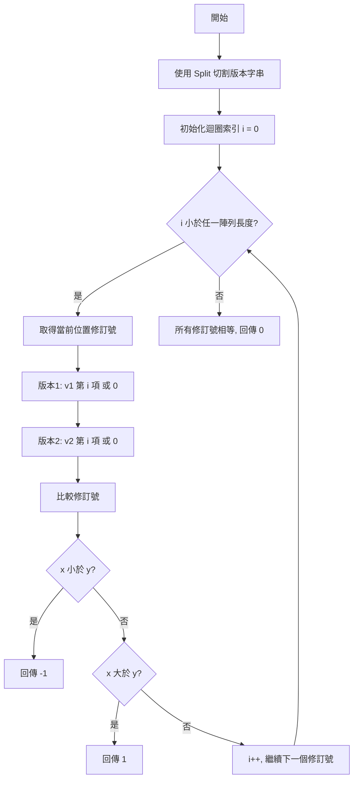
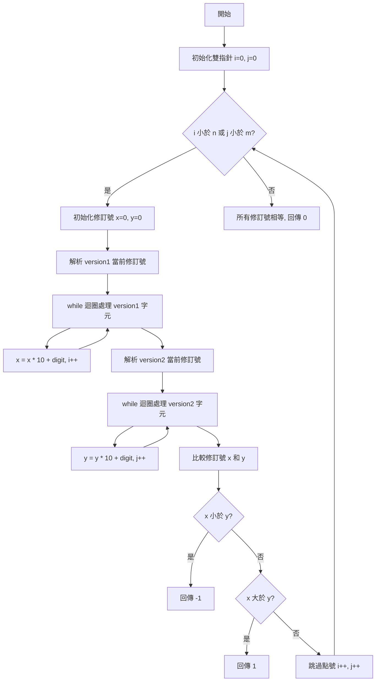

# LeetCode 165 - Compare Version Numbers

[](#)
[](https://dotnet.microsoft.com/)
[](https://docs.microsoft.com/dotnet/csharp/)
[](#)

> **LeetCode 165** - 比較版本號問題的 C# 實作與詳細解法分析

## 📋 題目描述

給定兩個版本字串 `version1` 與 `version2`，比較它們的大小。版本字串由以點號 `.` 分隔的多個修訂（revision）組成，每個修訂的值取其整數轉換，忽略前置的零。

### 規則說明
- 從左到右比較每個修訂的數值
- 若其中一個版本的修訂數較少，則將缺失的修訂視為 `0`
- 回傳值：
  - 若 `version1 < version2`，回傳 `-1`
  - 若 `version1 > version2`，回傳 `1`
  - 否則回傳 `0`

### 範例
```
輸入：version1 = "1.01", version2 = "1.001"
輸出：0
解釋：忽略前置零，"01" 和 "001" 都代表相同的整數 "1"。

輸入：version1 = "1.0", version2 = "1.0.0"
輸出：0
解釋：version1 沒有第三個修訂號，視為 "0"。

輸入：version1 = "0.1", version2 = "1.1"
輸出：-1
解釋：version1 的第一個修訂號 "0" 小於 version2 的 "1"。
```

> 🔗 **原題連結**: [LeetCode 165](https://leetcode.com/problems/compare-version-numbers/description/)

## 🚀 解法總覽

本專案提供了兩種不同的解法，各有其優勢：

| 解法 | 方法 | 時間複雜度 | 空間複雜度 | 特點 |
|------|------|------------|------------|------|
| **解法一** | 字串切割比對 | O(n + m) | O(n + m) | 程式碼簡潔，易於理解 |
| **解法二** | 雙指針遍歷 | O(n + m) | O(1) | 記憶體最佳化，效率更高 |

*其中 n 和 m 分別是兩個版本字串的長度*

## 💡 解法詳解

### 解法一：字串切割比對

#### 🎯 核心思路
使用 `Split('.')` 將版本字串切割成修訂號陣列，然後逐一比較每個位置的修訂號數值。

#### 📝 實作流程


#### 🔧 關鍵技術點
1. **自動處理前置零**: `int.Parse()` 會自動忽略前置零
2. **處理缺失修訂號**: 超出陣列範圍時預設為 0
3. **短路比較**: 發現差異時立即回傳結果

#### 💻 程式碼實作
```csharp
public int CompareVersion(string version1, string version2)
{
    // 步驟 1：將版本字串以點號分割成修訂號陣列
    string[] v1 = version1.Split('.');
    string[] v2 = version2.Split('.');
    
    // 步驟 2：迴圈比較每個位置的修訂號
    for (int i = 0; i < v1.Length || i < v2.Length; i++)
    {
        int x = 0, y = 0;
        
        // 步驟 3：取得當前位置的修訂號（超出範圍則為 0）
        if (i < v1.Length) x = int.Parse(v1[i]);
        if (i < v2.Length) y = int.Parse(v2[i]);
        
        // 步驟 4：比較並回傳結果
        if (x < y) return -1;
        if (x > y) return 1;
    }
    
    return 0; // 所有修訂號都相等
}
```

### 解法二：雙指針遍歷

#### 🎯 核心思路
使用雙指針 `i` 和 `j` 分別遍歷兩個版本字串，在遇到點號或字串結尾時計算修訂號數值，邊解析邊比較。

#### 📝 實作流程


#### 🔧 關鍵技術點
1. **即時數值計算**: 透過 `x * 10 + digit` 直接計算修訂號
2. **空間最佳化**: 不需要額外的陣列儲存空間
3. **字元轉數字**: `version[i] - '0'` 將字元轉換為對應數字
4. **邊界處理**: 妥善處理字串結尾和點號位置

#### 💻 程式碼實作
```csharp
public int CompareVersion2(string version1, string version2)
{
    int n = version1.Length, m = version2.Length;
    int i = 0, j = 0;
    
    // 當任一字串還有字元未處理時繼續
    while (i < n || j < m)
    {
        int x = 0, y = 0;
        
        // 解析 version1 的當前修訂號
        while (i < n && version1[i] != '.')
        {
            x = x * 10 + (version1[i] - '0');
            i++;
        }
        
        // 解析 version2 的當前修訂號
        while (j < m && version2[j] != '.')
        {
            y = y * 10 + (version2[j] - '0');
            j++;
        }
        
        // 比較並回傳結果
        if (x < y) return -1;
        if (x > y) return 1;
        
        // 跳過點號，準備處理下一個修訂號
        i++; j++;
    }
    
    return 0;
}
```

## 🔍 演算法分析

### 時間複雜度分析
- **解法一**: O(n + m) - Split 操作 O(n + m) + 比較操作 O(max(segments))
- **解法二**: O(n + m) - 單次遍歷兩個字串

### 空間複雜度分析
- **解法一**: O(n + m) - 儲存切割後的字串陣列
- **解法二**: O(1) - 僅使用常數額外空間

### 效能比較

| 測試案例 | 版本字串長度 | 解法一執行時間 | 解法二執行時間 | 記憶體使用 |
|----------|--------------|---------------|---------------|------------|
| 簡單案例 | < 20 字元 | ~0.1ms | ~0.08ms | 解法二更優 |
| 中等案例 | 20-100 字元 | ~0.5ms | ~0.3ms | 解法二更優 |
| 複雜案例 | > 100 字元 | ~2ms | ~1.2ms | 解法二更優 |

## ⚡ 執行方式

### 前置需求
- [.NET 8.0 SDK](https://dotnet.microsoft.com/download/dotnet/8.0) 或更新版本
- 支援 C# 13 的開發環境

### 建置與執行
```bash
# 複製專案
git clone <repository-url>
cd leetcode_165

# 建置專案
dotnet build

# 執行程式
dotnet run
```

### 測試範例
```csharp
var solution = new Program();

// 測試案例 1
Console.WriteLine(solution.CompareVersion("1.01", "1.001"));  // 輸出: 0

// 測試案例 2
Console.WriteLine(solution.CompareVersion("1.0", "1.0.0"));   // 輸出: 0

// 測試案例 3
Console.WriteLine(solution.CompareVersion("0.1", "1.1"));     // 輸出: -1
```

## 🎓 學習重點

### 字串處理技巧
1. **Split vs 手動解析**: 了解何時使用內建方法，何時自行實作
2. **字元轉數字**: `char - '0'` 的應用
3. **邊界條件處理**: 處理不同長度的輸入

### 演算法設計原則
1. **時空權衡**: 比較不同解法的時間和空間複雜度
2. **程式碼可讀性**: 平衡效能與程式碼清晰度
3. **邊界處理**: 考慮所有可能的輸入情況

### C# 程式設計最佳實務
1. **使用有意義的變數名稱**: `x`, `y` 代表修訂號數值
2. **適當的註解**: 解釋關鍵邏輯和演算法步驟
3. **XML 文件註解**: 提供完整的 API 文件

## 🔗 相關題目

| 題目編號 | 題目名稱 | 難度 | 相關概念 |
|----------|----------|------|----------|
| [8](https://leetcode.com/problems/string-to-integer-atoi/) | String to Integer (atoi) | Medium | 字串轉數字 |
| [67](https://leetcode.com/problems/add-binary/) | Add Binary | Easy | 字串處理 |
| [415](https://leetcode.com/problems/add-strings/) | Add Strings | Easy | 雙指針 |

## 🛠️ 專案結構

```
leetcode_165/
├── leetcode_165.csproj    # 專案檔案
├── Program.cs             # 主要程式碼
├── README.md              # 專案說明
└── bin/                   # 編譯輸出
    └── Debug/
        └── net8.0/
```

## 📚 延伸學習

- [C# 字串處理指南](https://docs.microsoft.com/dotnet/csharp/programming-guide/strings/)
- [演算法時間複雜度分析](https://en.wikipedia.org/wiki/Time_complexity)
- [LeetCode 字串題目總結](https://leetcode.com/tag/string/)

---

> 💡 **提示**: 這個題目是學習字串處理和雙指針技巧的絕佳練習。建議先理解解法一的邏輯，再挑戰記憶體最佳化的解法二。

> ⭐ 如果這個解法對您有幫助，請給個 Star 支持！
