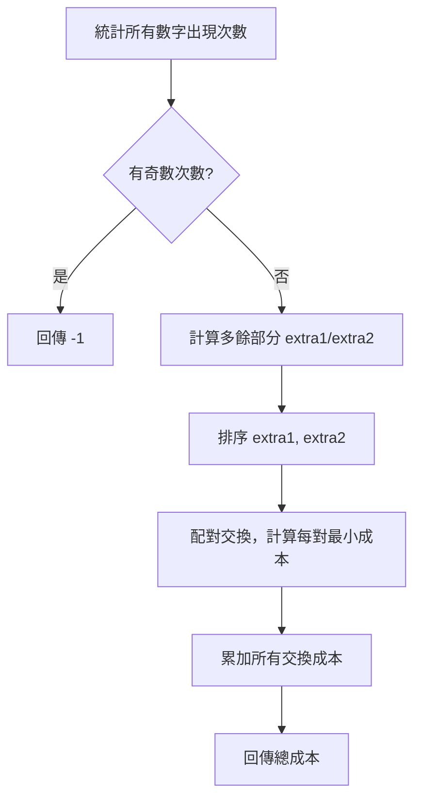

# 🥝 Leetcode 2561: Rearranging Fruits

> 以 C# 實作 LeetCode 2561 題「重排水果」的解題專案，展示高效且易於維護的演算法設計。

---

## 專案簡介

本專案提供 LeetCode 2561「重排水果」問題的 C# 解法，並附有詳細註解與測試案例。你可以直接執行、學習演算法邏輯，或作為 C# 演算法專案的範本。

> [!TIP]
> 本專案適合用於演算法學習、C# 語法練習，或作為 LeetCode 題解參考。

---

## 快速開始

### 需求

- .NET 8.0 SDK 或以上
- macOS、Windows 或 Linux

### 執行步驟

```zsh
# 1. 下載專案
# 2. 進入專案資料夾
cd leetcode_2561

# 3. 建構並執行
dotnet build
# 或
# dotnet run --project leetcode_2561/leetcode_2561.csproj

# 4. 執行主程式
cd leetcode_2561
 dotnet run
```

---

## 範例輸出

```text
最小交換成本: 1
最小交換成本: -1
```

---

## 專案結構

```text
leetcode_2561.sln                # 方案檔
leetcode_2561/                   # 專案主目錄
  leetcode_2561.csproj           # C# 專案檔
  Program.cs                     # 主程式與解題邏輯
  bin/                           # 編譯輸出
  obj/                           # 中繼檔
```

---

## 主要技術與依賴

- C# 13（.NET 8.0+）
- 無外部函式庫依賴

---

## 題目連結

- [LeetCode 2561. Rearranging Fruits (EN)](https://leetcode.com/problems/rearranging-fruits/)
- [LeetCode 2561. 重排水果 (中文)](https://leetcode.cn/problems/rearranging-fruits/)

> [!NOTE]
> 若需進一步優化或加入單元測試，請參考 `Program.cs` 內詳細註解。

---

## 解題思路與演算法流程

本題目要求將兩個水果籃內容重排為完全相同，並使交換成本最小。以下為 `MinCost` 函式的詳細解法流程：

1. **統計所有水果成本的出現次數**
   - 將 basket1、basket2 內所有數字的出現次數累加，若有任何數字出現次數為奇數，則無法重排，直接回傳 -1。
2. **計算多餘部分**
   - 對於每個數字，計算在 basket1、basket2 中多出來的部分，分別記錄需要換出去（extra1）與換進來（extra2）的數字。
3. **排序並配對交換**
   - 將 extra1 由小到大排序，extra2 由大到小排序，兩者一一配對。
4. **計算交換成本**
   - 每對 (a, b) 的交換成本為 `min(a, b, 2 * 全局最小值)`，即直接交換與間接交換（用全局最小值作為中介）取最小值。
5. **累加所有交換成本**
   - 將所有配對的最小交換成本加總即為答案。

> [!TIP]
> 此演算法能保證每次交換都以最小成本完成，並處理所有無法重排的特殊情況。

### 程式流程圖



#### 間接交換說明

有時候，直接交換兩個水果的成本較高，這時可以考慮「間接交換」：

- 先將一個水果換成全局最小值，再用最小值與另一個水果交換。
- 這樣的總成本為 `2 * 全局最小值`，有機會比直接交換更便宜。

**用意**：
- 避免高成本的直接交換，利用全局最小值作為中介，降低總交換成本。

**舉例**：
- 若要交換 100 和 99，且全局最小值為 1，
  - 直接交換成本為 99。
  - 間接交換成本為 1（100→1）+ 1（1→99）= 2。
  - 因此選擇間接交換更划算。

> [!TIP]
> 實作時，每對交換都取 `min(a, b, 2 * minVal)`，自動選擇最省成本的方式。
